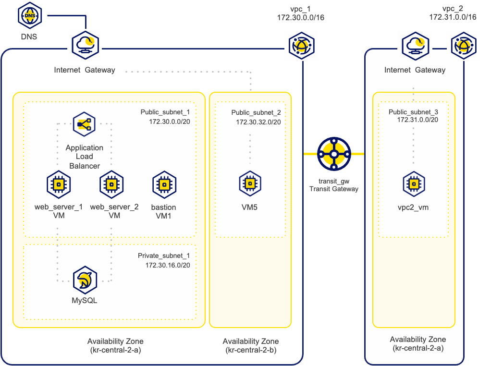
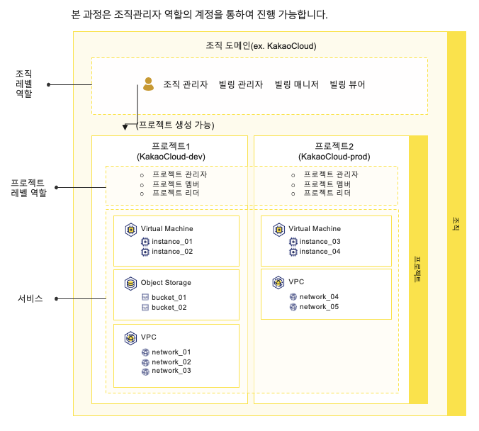
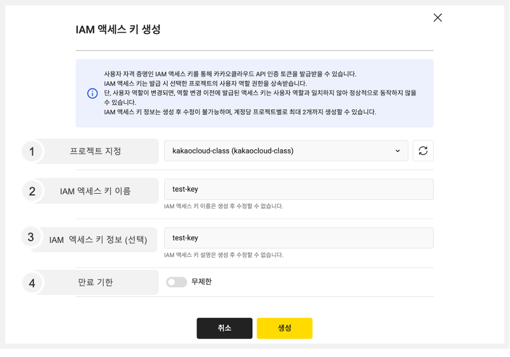
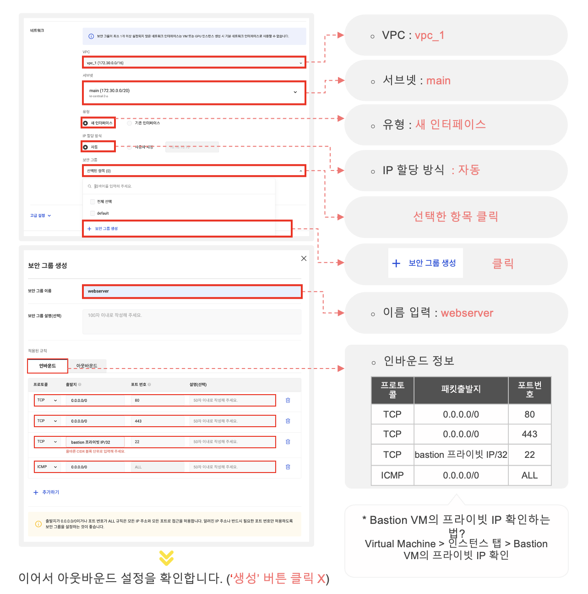
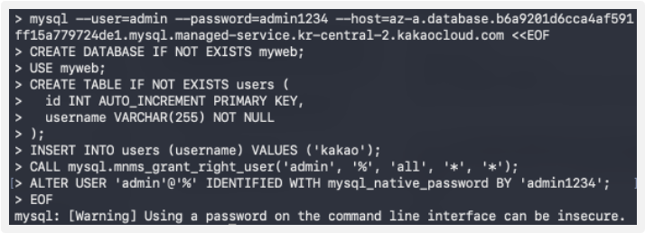
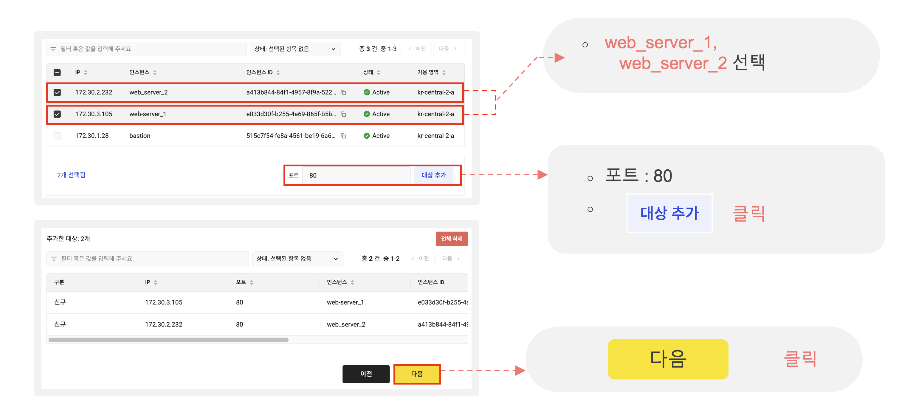
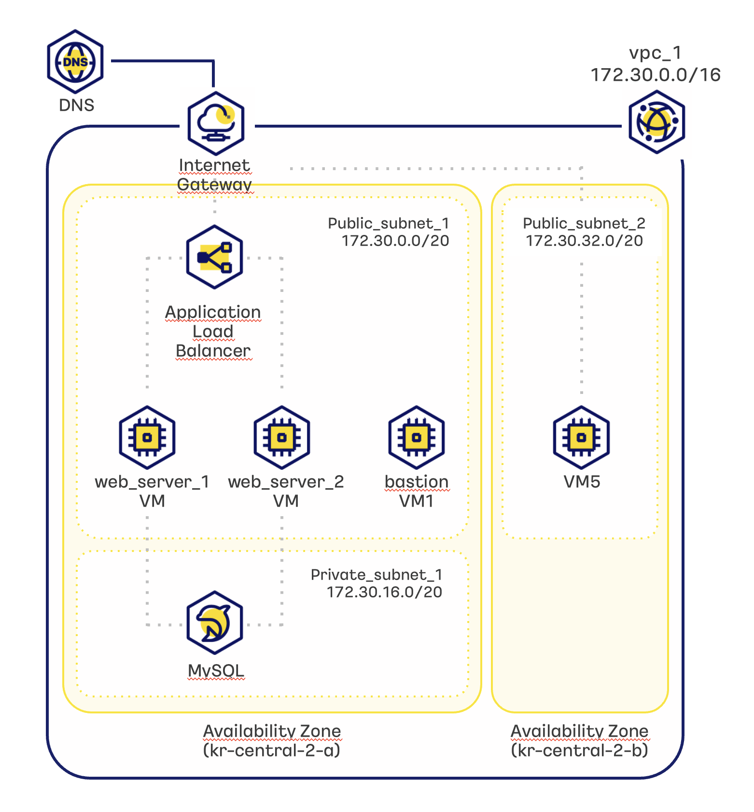

<!-- _class: cover portrait -->

# KakaoCloud<br>
Essential Basic Course

T6-03  
Hands on 실습교재

# kakaocloud

---

<!-- _class: portrait contents -->

본 교재는 카카오클라우드 기초 교육을 위한 실습 교재이며, 총 14개의 실습 중 Demo(시연)가 포함될  수 있습니다. 실습 과정은 카카오클라우드 환경에서의 기본적인 인프라 관리와 서비스 구축을 다룹니다.

본 실습에서 사용되는 명령어는 깃허브에서 확인할 수 있습니다.  (Github Link)

## CONTENTS

Lab1 : IAM 주요 구성 요소 생성 실습  
Lab2: IAM 엑세스 키 생성 실습  
Lab3 : VPC 생성 실습  
Lab4 : VM 생성 실습  
Lab5 : Private 서브넷 구성 및 MySQL을 통한 DB 구축 실습  
Lab6 : 웹서버 이중화 및 LB 구성 실습  
Lab7 : Multi-AZ 구성 및 DNS 실습  
Lab8 : TGW 구성 실습  
Lab9 : File Storage 실습  
Lab10 : 카카오 클라우드 Console을 활용한 Object Storage 실습  
Lab11 : API를 활용한 Object Storage 실습  
Lab12 : Monitoring 실습  
Lab13 : Alert Center 실습  
Lab14 : 리소스 삭제 실습



---

<!-- _class: portrait lab1 -->

# Lab1 : IAM 주요 구성 요소 생성 실습

<div class="slide-grid">

<div class="content compact">

## 이론 교재 39p

## 실습 내용

IAM을 통해 프로젝트를 생성하여 사용자를 추가하고 사용자에 역할을 부여하는 실습을 진행합니다.

## 실습 순서

1. 프로젝트 생성
2. 사용자 추가
3. 역할 부여

</div>

<div class="visual">



</div>

</div>

---

<!-- _class: portrait lab2 -->

# Lab2 : IAM 엑세스 키 생성

## IAM 엑세스 키 생성



## 1 프로젝트 지정

IAM 엑세스 키에 IAM 역할을 할당할 프로젝트 선택

선택한 프로젝트의 역할(프로젝트 관리자 또는 프로젝트  
멤버) 권한을 IAM 엑세스 키에 부여함

## 2 IAM 엑세스 키 이름

공백 없이 알파벳 소문자(a-z), 숫자(0-9), 하이픈  
(-)만 입력 가능(4~20자)

다른 엑세스 키와 구분할 수 있는 이름을 입력 필요

*중복된 이름 사용 불가

## 3 IAM 엑세스 키 정보 (선택)

엑세스 키에 대한 부가 정보

IAM 엑세스 키가 생성된 이후에는 수정 불가

글자 수 : 4~30자

## 4 만료 기한

* 입력한 일자의 23:59:59까지 엑세스 키 사용
    가능
* Off 시 기간 없이 무제한 사용 가능

---

<!-- _class: portrait lab4 -->

# Lab4 : VM 생성 실습

## Web VM 인스턴스 생성

6. VPC 선택  : vpc_1 / 7. 서브넷 선택 : main / 8. 유형 : 새 인터페이스 / 9. IP 할당 방식 : 자동

10.  보안 그룹 생성 클릭 / 11. 보안 그룹 이름 입력 : webserver / 12. 인바운드 정보 입력 :



---

<!-- _class: portrait lab5 -->

# Lab5 : Private 서브넷 구성 및 MySQL을 통한 DB 구축 실습

## Bastion 서버에  MySQL 인스턴스 그룹 연결 및 DB 설정  
MySQL 접속하여 DB 설정 하기

4. 명령어에 [엔드포인트URL]을 붙여 넣어 터미널에 입력하여 DB 접속 및 데이터베이스 설정

아래의 스크립트를 복사 후 터미널에 붙여 넣습니다.  
*Github 사이트에서도 복사 가능 (Lab05 link)

```sql
mysql --user=admin --password=admin1234 --host={엔드포인트URL} <<EOF
CREATE DATABASE IF NOT EXISTS myweb;
USE myweb;
CREATE TABLE IF NOT EXISTS users (
  id INT AUTO_INCREMENT PRIMARY KEY,
  username VARCHAR(255) NOT NULL
);
INSERT INTO users (username) VALUES ('kakao');
CALL mysql.mnms_grant_right_user('admin', '%', 'all', '*', '*');
ALTER USER 'admin'@'%' IDENTIFIED WITH mysql_native_password BY 'admin1234';
EOF
```



---

<!-- _class: portrait lab5-detail -->

# Lab5 : Private 서브넷 구성 및 MySQL을 통한 DB 구축 실습

## Bastion에 MySQL  
인스턴스 그룹 연결 및 DB 설정

Bastion 서버에  MySQL 인스턴스 그룹 연결 및 DB 설정  
MySQL 접속하여 DB 설정 하기

4. (계속) 명령어에 대한 상세 설명

6. 사용자(Admin)에게 권한 부여 및 password 인증 방식 및 설정

## [명령어에 대한 설명]

- 데이터베이스 ‘myweb’ 생성
- 작업 데이터베이스를 ‘myweb’ 으로  설정
- username을 확인할 수 있는 테이블 ‘users’ 생성
- 테이블 ‘users’의 username에 ‘kakao’ 삽입
- 사용자 'admin'에게 모든 호스트('%’) 에서 모든 - 데이터베이스와  테이블에 대한 모든 권한을 부여
- ‘admin' 사용자를 '%' 호스트에서 'mysql_native_password’ 방식으로 인증하며, 비밀번호를 'admin1234'로 설정

아래의 스크립트를 복사 후 터미널에 붙여 넣습니다.  
*Github 사이트에서도 복사 가능 (Lab05 link)

```sql
mysql --user=admin --password=admin1234 --host={엔드포인트URL} <<EOF
```

```sql
CREATE DATABASE IF NOT EXISTS myweb;
```

```
USE myweb;
```

```sql
CREATE TABLE IF NOT EXISTS users (
  id INT AUTO_INCREMENT PRIMARY KEY,
  username VARCHAR(255) NOT NULL
);
```

```sql
INSERT INTO users (username) VALUES ('kakao');
```

```sql
CALL mysql.mnms_grant_right_user('admin', '%', 'all', '*', '*');
```

```sql
ALTER USER 'admin'@'%' IDENTIFIED WITH mysql_native_password BY 'admin1234';
```

```sql
EOF
```

---

<!-- _class: portrait lab6 -->

# Lab6 : 웹서버 이중화 및 LB 구성 실습

## 로드 밸런서 생성 및 설정

대상 그룹 생성

12. web_server_1, web_server_2 선택 / 13. 포트 입력: 80 / 14. 대상 추가 / 15. [다음] 버튼 클릭



잠깐           Tip! :   상태 확인 더 알아보기

#### 확인주기:

상태 확인을 수행하는 빈도를 나타냄  
ex) 로드 밸런서가 30초마다 연결된 서버에 대한 상태 확인을 수행한다면, 체크주기는 30초임

#### 타임아웃:

상태 확인 요청이 반응을 받기를 기다리는 최대 시간을 말함  
ex) 타임아웃이 4초로 설정되어 있고 로드 밸런서가 서버에 상태 확인 요청을 보냈지만, 4초 내에 응답을 받지 못하면 해당 요청은 실패로 처리됨

#### 상태 전환 기준 (성공) :

“Unhealthy”서버가 다시 “Healthy”로 판정되기 위해 연속적으로 성공해야 하는 상태 확인 횟수를 말함  
ex) 상태전환기준(실패)가 2로 설정되어 있다면, “Unhealthy”로 판정된 서버가 연속 2회의 상태 확인에 성공하면 다시 “Healthy”로 판정됨

#### 상태 전환 기준(실패):

서버가 “Unhealthy”로 판정되기 전에 연속적으로 실패해야 하는 상태 확인의 횟수를 말함  
ex) 상태전환기준(성공)이 5로 설정되어 있다면, 연속 5회의 상태 확인 실패 후에 서버는 “Unhealthy”로 판정됨

---

<!-- _class: portrait lab7 -->

# Lab7 : Multi-AZ 구성 및 DNS 실습

## DNS 서비스 동작 확인

연결한 도메인을 브라우저 창에 입력

[kakaocloud-edu.com](https://kakaocloud-edu.com)



---

<!-- _class: portrait lab14 -->

# Lab14 : 리소스 삭제

## 실습 내용

불필요한 리소스 삭제는 비용을 절감하고 보안을 강화하며 자원을 최적화하며 확장성을 향상시키고 운영 관리를 간소화하는데 도움을 줍니다.


1. Alert Center ☞ 알림 정책 ☞ 생성된 알림 정책 오른쪽 (...) 클릭☞ 삭제 클릭 ☞ 정책 이름 입력 ☞ 삭제 버튼 클릭  ☞ 수신 채널 ☞ 생성된 수신 채널 오른쪽 (...) 클릭 ☞ 삭제 클릭 ☞ 수신 채널 이름 입력 ☞ 삭제  버튼 클릭

2. Virtual Machine ☞ 인스턴스 ☞ 모두 체크 ☞ 우측 상단 인스턴스 삭제 버튼 클릭 ☞ 영구 삭제 입력 ☞ 삭제 버튼 클릭

3. DNS ☞ DNS 영역 ☞ DNS 이름 ☞ 추가했던 상단 레코드 오른쪽 (...) 클릭 ☞ 레코드 삭제 클릭☞ 레코드 이름 입력 ☞ 삭제 버튼 클릭  ☞ DNS 영역 ☞ 생성한 DNS 영역 오른쪽 (...) 클릭 ☞ 삭제 클릭 ☞ DNS 영역 이름 입력 ☞ 삭제 버튼 클릭

4. Load Balancing ☞ 로드 밸런서 ☞ 생성 되어있는 로드 밸런서 오른쪽 (...) 클릭☞ 로드 밸런서 삭제 클릭 ☞ 로드 밸런서 이름 입력 ☞ 삭제 버튼 클릭

5. Transit Gateway ☞ 생성되어 있는 Transit Gateway 이름 클릭 ☞ Attachment 탭 클릭 ☞ 생성되어 있는 Attachment의 오른쪽 (...) 클릭 ☞ 삭제 클릭 ☞ Attachment ID 입력 ☞ 삭제 버튼 클릭

6. Transit Gateway ☞ Transit Gateway 오른쪽 (...) 클릭 ☞ 삭제 클릭 ☞ Transit Gateway 이름 입력 ☞ 삭제 버튼 클릭

7. MySQL ☞ 인스턴스 그룹☞ 생성되어 있는 인스턴스 그룹 오른쪽 (...) 클릭 ☞ 삭제 클릭 ☞ 인스턴스 그룹 이름 입력 ☞ 삭제 버튼 클릭

8. File Storage ☞ 인스턴스 ☞ 생성되어 있는 인스턴스 오른쪽 (...) 클릭 ☞ 삭제 클릭  ☞ 인스턴스 이름 입력 ☞ 삭제 버튼 클릭

9. Object Storage ☞ 일반 버킷 ☞ 생성되어 있는 버킷 오른쪽 (...) 클릭 ☞ 버킷 비우기  ☞ 영구 삭제 입력 및 비우기 버튼 클릭 ☞ 생성되어 있는 버킷 오른쪽 (...)  클릭☞ 버킷 삭제 클릭☞ 버킷 이름 입력 ☞ 삭제 버튼 클릭

10. VPC ☞ 퍼블릭 IP ☞ 모두 선택 ☞ 좌측 하단 삭제 버튼 클릭 ☞ 영구 삭제 입력 ☞ 삭제 버튼 클릭

11. VPC ☞ 생성되어 있는 VPC 오른쪽 (...) 클릭 ☞ VPC 삭제 클릭 ☞ VPC 이름 입력 ☞ 삭제 버튼 클릭

12. 계정 설정 ☞ 자격 증명 ☞ IAM 엑세스 키 탭 클릭 ☞ 생성되어 있는 IAM 엑세스 키 오른쪽 (…) 클릭 ☞ 삭제 클릭 ☞ IAM 액세스 키 삭제 입력 및 삭제 버튼 클릭

13. Virtual Machine ☞ 키 페어 ☞ 생성되어 키 페어 오른쪽 (…) 클릭 ☞ 키 페어 삭제 클릭 ☞ 키 페어 이름 입력 ☞ 삭제 버튼 클릭

14. VPC ☞ 보안 그룹 ☞ 생성되어 있는 보안 그룹 오른쪽 (...) 클릭 ☞ 보안 그룹 삭제 클릭 ☞ 보안그룹 이름 입력 ☞ 삭제 버튼 클릭
